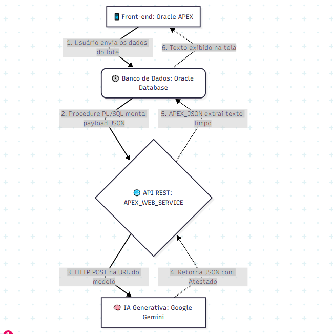

# 🌱 Verdantis - IA Generativa & APEX
**Disruptive Architectures: IOT, IOB & Generative IA**

## 🎯 Objetivo do Projeto
Este repositório contém a documentação e a integração do componente de Inteligência Artificial Generativa para o projeto **Verdantis**, um sistema de rastreabilidade para o agronegócio focado em reduzir perdas de exportação por falta de certificação sustentável.

A IA foi implementada no banco de dados para atuar como um **Gerador Automático de Relatórios de Sustentabilidade**, transformando dados técnicos brutos de lotes agrícolas em atestados comerciais claros usando processamento de linguagem natural.

## 🎥 Pitch e Demonstração
[Assista ao vídeo de apresentação da arquitetura e funcionamento (YouTube)](https://youtu.be/Zm3sUfeqVUI) 

## 🧠 Arquitetura e IA

* **O Problema:** Dados de rastreabilidade agrícola (variações de temperatura, umidade, uso de defensivos) são puramente técnicos e difíceis de interpretar. Auditores internacionais e consumidores finais precisam de garantias claras, não de logs de banco de dados.
* **Modelo Escolhido:** LLM (Large Language Model) integrado via API REST (Google gemini-3-flash-preview).
* **Justificativa:** Optamos por consumir um LLM pré-treinado via API devido à necessidade de interpretação de contexto e geração de texto narrativo. A técnica de *Zero-shot prompting* elimina a necessidade de treinar um modelo de Machine Learning do zero, entregando resultados de alta qualidade de forma ágil, com baixo custo computacional local e integração direta com o PL/SQL.
* **Dados Utilizados:** Dados técnicos do lote agrícola (produto, número do lote, temperatura, certificações) capturados no front-end e enviados em formato JSON. Quantidade mínima: 1 lote por inferência.

## ⚙️ Fluxo de Comunicação (APEX > Oracle DB > IA)

1. O usuário insere os dados de rastreabilidade do lote na interface gráfica do **Oracle APEX** e aciona a análise.
2. O sistema executa um processo PL/SQL usando o pacote nativo `APEX_WEB_SERVICE`.
3. O Oracle Database monta um payload JSON com as variáveis e faz uma requisição HTTP POST (REST) para o endpoint do modelo LLM.
4. A IA processa as variáveis e devolve o atestado gerado em formato JSON.
5. O PL/SQL utiliza o pacote `APEX_JSON` para fazer o *parse* da resposta, extraindo apenas o texto limpo, que é retornado e exibido na tela do usuário no APEX.

## 🚀 Como visualizar o código
O script PL/SQL contendo a lógica de integração REST, montagem do payload e extração do retorno JSON está disponível na pasta `/database` deste repositório, no arquivo `integracao_ia.sql`.