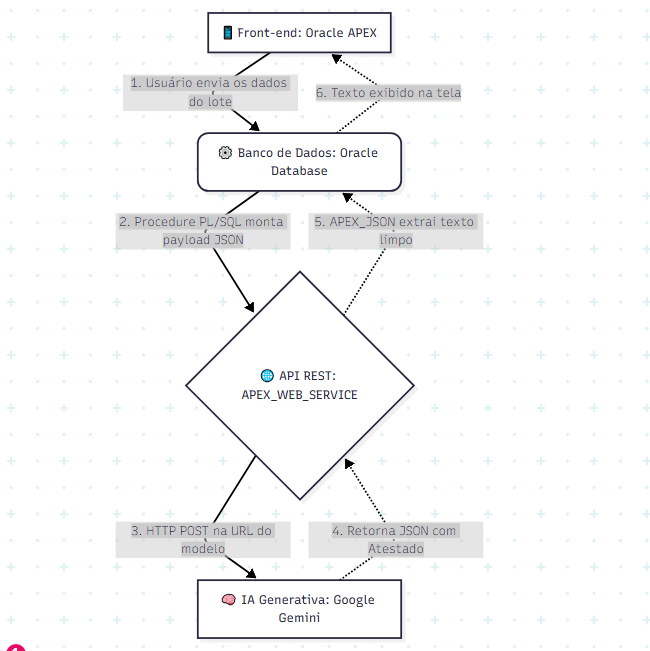

# 🌱 Verdantis - IA Generativa & APEX
**Disruptive Architectures: IOT, IOB & Generative IA**

## 🎯 Objetivo do Projeto
Este repositório contém a documentação e a integração do componente de Inteligência Artificial Generativa para o projeto **Verdantis**, um sistema de rastreabilidade para o agronegócio. 

Nesta entrega final, a IA foi evoluída para atuar como um **Motor de Decisão e Auditoria Regulatória Internacional**. Em vez de apenas resumir dados, a IA analisa métricas brutas (temperatura, origem, selos) e emite pareceres de compliance (Aprovação/Rejeição) baseados em legislações reais, como a EUDR (European Union Deforestation Regulation), gerando a documentação aduaneira automaticamente.

## 🎥 Pitch e Demonstração
[Assista ao vídeo de apresentação da arquitetura e funcionamento (YouTube)](https://youtu.be/Zm3sUfeqVUI) 

## 🧠 Arquitetura, Modelo e Utilidade da IA

* **O Problema (A Utilidade):** Dados de rastreabilidade agrícola são puramente técnicos. O desafio não é apenas ler esses dados, mas interpretá-los sob a ótica de regras alfandegárias flutuantes. Auditores internacionais precisam de garantias de compliance (como ausência de desmatamento e integridade térmica da carga). Um sistema tradicional de `IF/ELSE` não escala para interpretação de documentos e regras complexas.
* **Modelo Escolhido:** `Google Gemini 3 Flash Preview` consumido via API REST.
* **Justificativa do Modelo:** Optamos pela versão *Flash* devido à sua latência ultrabaixa, ideal para integrações transacionais em tempo real no banco de dados. Utilizamos a técnica de *Zero-shot prompting* aliada a *Role Prompting* (instruindo a IA a atuar como Auditora Aduaneira). Isso elimina a necessidade e o alto custo computacional de treinar um modelo preditivo do zero, entregando decisões complexas e geração de texto bilíngue de forma ágil e direta via PL/SQL.

## 🧪 Evidências de Teste e Validação
Para demonstrar a capacidade cognitiva da IA, realizamos testes de estresse com cenários reais de exportação.

**Entrada (Lote validado via APEX):**
`Lote 405, Soja, Origem: Mato Grosso, Temp: 17°C, Certificado: Livre de Desmatamento (EUDR Compliant).`

**Saída Processada pela IA:**
A IA atestou o **STATUS: APROVADO**, validou biologicamente que 17°C previne proliferação fúngica na soja, reconheceu a certificação EUDR exigida na Europa e gerou o *Customs Memo* em inglês recomendando a liberação imediata da carga. *(Vide demonstração no vídeo pitch).*

## ⚙️ Fluxo de Comunicação (APEX > Oracle DB > IA)

1. O usuário insere os dados de rastreabilidade do lote na interface gráfica do **Oracle APEX** e aciona a análise.
2. O sistema executa um processo PL/SQL usando o pacote nativo `APEX_WEB_SERVICE`.
3. O Oracle Database monta um payload JSON com as variáveis e o prompt de engenharia de auditoria, e faz uma requisição HTTP POST (REST) para o endpoint do modelo Gemini.
4. A IA processa as variáveis, executa o motor de regras e devolve o parecer estruturado em formato JSON.
5. O PL/SQL utiliza o pacote `APEX_JSON` para fazer o *parse* da resposta, extraindo o texto limpo, que é retornado e exibido na tela do usuário no APEX.

## 🚀 Como visualizar o código
O script PL/SQL contendo a lógica de integração REST, montagem do payload com as regras de *Role Prompting* e extração do retorno JSON está disponível na pasta `/database` deste repositório, no arquivo `integracao_ia.sql`.
